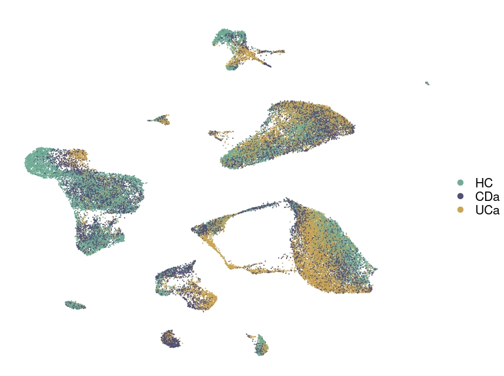

# Single cell RNAseq of inflammatory bowel disease patients

Code repository for our paper.

We present a single cell dateset on IBD, including 12 patients (6 Chron's Disease and 6 Ulcerative colitis patients) and 6 healthy controls for:

-   Analysis of samples by health

-   Analysis of samples together

-   Comparison with publicly available data

You can inspect our dataset easily, by using our ShinyApp [here](https://www.google.com/). 

# Abstract

# Code implementation

`Analyisis of our data`: htmls with code and results of the analyisis of

  - `01_Samples_by_health`: samples analyzed separately for HC and IBD
  
  - `02_Samples_together`: samples analysed together
  
`Other datasets`: codes used for the different analysis in our publication

`source`: source codes needed for the analysis
